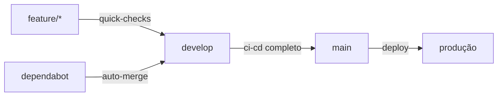

# 🚀 GitHub Actions Workflows

Este diretório contém os workflows otimizados do GitHub Actions para o projeto.

## 📋 **Workflows Ativos**

### 🔄 `ci-cd.yml` - Pipeline Principal

**Executa em:** `push` e `pull_request` para `main` e `develop`

- **🔍 Lint**: Análise estática, code style, e verificações de segurança
- **🧪 Test**: Testes unitários e de integração com PostgreSQL
- **🛡️ Security**: Auditoria de dependências e scan de vulnerabilidades
- **📚 Documentation**: Geração automática de diagramas UML
- **🚀 Deploy**: Build e deploy para produção (apenas na `main`)
- **📢 Notify**: Notificações no Slack sobre o status

**Otimizações:**

- ✅ Jobs paralelos com dependências otimizadas
- ✅ Cache inteligente para Composer e NPM
- ✅ Detecção de mudanças para pular jobs desnecessários
- ✅ Concurrency control para cancelar builds antigos

### ⚡ `quick-checks.yml` - Verificações Rápidas

**Executa em:** `push` para `develop` e branches `feature/*`

Pipeline simplificado para desenvolvimento rápido:

- ✅ Code style check
- ✅ Static analysis
- ✅ Testes rápidos
- ✅ Build check

**Benefícios:**

- 🚀 ~3x mais rápido que o pipeline completo
- 🎯 Foca apenas nas mudanças detectadas
- ⚡ Feedback instantâneo para desenvolvedores

### 🤖 `dependabot.yml` - Auto-merge do Dependabot

**Executa em:** PRs do Dependabot

- ✅ Auto-aprova atualizações patch e minor
- ✅ Auto-merge para atualizações patch seguras
- ✅ Mantém dependências sempre atualizadas

### 🧹 `cleanup.yml` - Limpeza Automática

**Executa em:** Agendamento semanal

- 🗑️ Remove workflow runs antigos (>30 dias)
- 🗑️ Remove artifacts antigos
- 📊 Monitora tamanho do repositório

## 📊 **Comparação: Antes vs Depois**

| Aspecto               | ❌ Workflows Antigos | ✅ Workflows Otimizados |
| --------------------- | -------------------- | ----------------------- |
| **Quantidade**        | 6 workflows          | 4 workflows             |
| **Duplicação**        | Alta                 | Zero                    |
| **Tempo Execução**    | ~15-20 min           | ~8-12 min               |
| **Cache**             | Parcial              | Completo                |
| **Paralelização**     | Básica               | Avançada                |
| **Detecção Mudanças** | Não                  | Sim                     |
| **Auto-merge**        | Manual               | Automático              |
| **Limpeza**           | Manual               | Automática              |

## ⚙️ **Configuração Necessária**

### Secrets Obrigatórios

```bash
# Para deploy (se habilitado)
DEPLOY_HOST=seu-servidor.com
DEPLOY_USER=deploy
DEPLOY_KEY=sua-chave-ssh

# Para notificações (opcional)
SLACK_WEBHOOK_URL=https://hooks.slack.com/...

# Para scan de segurança (opcional)
SNYK_TOKEN=seu-token-snyk
```

### Variáveis de Ambiente

```yaml
# Já configuradas nos workflows
PHP_VERSION: '8.4'
NODE_VERSION: '22'
WORKING_DIR: src
```

## 🎯 **Estratégia de Branches**



## 🚀 **Como Usar**

### Para Desenvolvimento

1. **Feature branches**: Use `feature/nome-da-feature`
2. **Push**: Executa `quick-checks.yml` automaticamente
3. **PR para develop**: Executa verificações rápidas
4. **PR para main**: Executa pipeline completo

### Para Deploy

1. **Merge na main**: Deploy automático para produção
2. **Rollback**: Use `workflow_dispatch` no workflow de deploy
3. **Hotfix**: Crie branch `hotfix/*` e faça PR direto para main

## 📈 **Monitoramento**

### Métricas Importantes

- ⏱️ **Tempo de execução**: Meta < 10 minutos
- ✅ **Taxa de sucesso**: Meta > 95%
- 🔄 **Frequência**: ~10-20 execuções/dia
- 💾 **Cache hit rate**: Meta > 80%

### Troubleshooting

```bash
# Ver logs detalhados
gh run list --limit 10
gh run view RUN_ID --log

# Reexecutar workflow falhado
gh run rerun RUN_ID

# Cancelar workflows em execução
gh run cancel RUN_ID
```

## 🔧 **Personalização**

### Ajustar versões

```yaml
env:
  PHP_VERSION: '8.4' # Altere conforme necessário
  NODE_VERSION: '22' # Altere conforme necessário
```

### Desabilitar jobs

```yaml
# Adicione condition para pular jobs
if: false # Desabilita o job
```

### Adicionar novos checks

```yaml
- name: 🔍 Novo Check
  run: seu-comando-aqui
```

## 📚 **Links Úteis**

- [📖 GitHub Actions Docs](https://docs.github.com/en/actions)
- [🔧 Workflow Syntax](https://docs.github.com/en/actions/using-workflows/workflow-syntax-for-github-actions)
- [⚡ Performance Tips](https://docs.github.com/en/actions/using-workflows/workflow-commands-for-github-actions)
- [🛡️ Security Best Practices](https://docs.github.com/en/actions/security-guides/security-hardening-for-github-actions)
