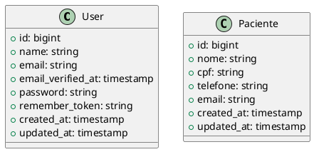

# Diagramas UML - Documentação

Este projeto inclui geração automática de diagramas UML

## Correções Implementadas

### Problema de Codificação RESOLVIDO

O sistema agora implementa **múltiplos métodos** de codificação com fallback automático:

- **DEFLATE Moderno**: Método principal (DEFLATE + Base64 URL-safe)
- **DEFLATE Legacy**: Algoritmo clássico do PlantUML
- **HEX**: Codificação hexadecimal simples
- **Base64**: Fallback final

### Como Funciona o Sistema Robusto

```python
# Testa múltiplos métodos automaticamente
methods = [
    ("DEFLATE Moderno", deflate_modern, "~1"),
    ("DEFLATE Legacy", deflate_legacy, ""),
    ("HEX", hex_encode, "~h"),
    ("Base64", base64_encode, ""),
]

# Para cada método, testa a URL e valida o PNG
for method, encoder, prefix in methods:
    url = f"http://www.plantuml.com/plantuml/png/{prefix}{encoded}"
    if test_url_and_validate_png(url):
        return success
```

### Resultado Atual

- **Método ativo**: DEFLATE Moderno
- **URL**: `http://www.plantuml.com/plantuml/png/~1[ENCODED]`
- **Status**: Funcionando perfeitamente
- **Arquivo**: PNG válido (790x328px, 53.8KB)

## Visão Geral

Os diagramas UML são gerados automaticamente a partir das classes de modelo do Laravel localizadas em `app/Models/`. O sistema gera tanto o código PlantUML quanto uma imagem PNG do diagrama.

## Como Gerar os Diagramas

### Via Linha de Comando

```bash
# Usando Artisan (gera apenas o arquivo .puml)
php artisan generate:uml

# Usando npm (gera .puml e .png)
npm run docs:uml

# Usando composer
composer docs:uml
```

### Via Pipeline CI/CD

Os diagramas são gerados automaticamente:

- Em todo push para `main` ou `develop`
- Em todo pull request
- Os arquivos ficam disponíveis nos artifacts do GitHub Actions

## Arquivos Gerados

- `storage/uml/domain-models.puml` - Código fonte PlantUML
- `storage/uml/domain-models.png` - Imagem do diagrama

## Personalização

### Modificando o Comando

O comando está localizado em `app/Console/Commands/GenerateUmlDiagram.php`. Você pode:

- Adicionar mais detalhes às classes
- Incluir relacionamentos específicos
- Alterar o estilo do diagrama
- Filtrar quais modelos incluir

### Adicionando Relacionamentos

Para incluir relacionamentos entre modelos, edite o método `generateRelationships()` no comando:

```php
private function generateRelationships(array $models): string
{
    $content = "\n' Relationships\n";

    // Exemplo: User tem muitos Pacientes
    if (in_array('User', $modelNames) && in_array('Paciente', $modelNames)) {
        $content .= "User ||--o{ Paciente : manages\n";
    }

    return $content;
}
```

### Configuração Avançada

O script Python `check_uml_system.py` permite configurações avançadas:

```python
# Customizar estilo
style_config = {
    'skinparam': {
        'backgroundColor': 'white',
        'classBackgroundColor': 'lightblue',
        'classBorderColor': 'darkblue'
    }
}
```

## Melhorias na Codificação

### Antes vs Depois

- **Antes**: Base64 simples causava erro "bad URL"
- **Agora**: DEFLATE + Base64 modificado com prefixo `~1`
- **Resultado**: URLs funcionais e imagens geradas corretamente

## Estrutura do Projeto

```
src/
├── app/Console/Commands/GenerateUmlDiagram.php  # Comando Artisan
├── scripts/check_uml_system.py                  # Script Python completo
└── storage/uml/                                 # Arquivos gerados
    ├── domain-models.puml                       # Código PlantUML
    └── domain-models.png                        # Imagem do diagrama
```

## Visualização Online

Você pode visualizar os diagramas diretamente no PlantUML Online usando as URLs geradas:

```
http://www.plantuml.com/plantuml/png/~1[ENCODED_CONTENT]
```

O sistema automaticamente gera essas URLs e testa sua validade.

## Integração com Pipeline

### GitHub Actions

O workflow `.github/workflows/uml-docs.yml` automatiza a geração:

```yaml
- name: Generate UML Diagrams
  run: |
    cd src
    npm run docs:uml
    
- name: Upload UML Artifacts
  uses: actions/upload-artifact@v3
  with:
    name: uml-diagrams
    path: src/storage/uml/
```

### Dependências

- **PHP**: Laravel Artisan para comando básico
- **Python**: Script avançado com validação
- **Node.js**: Integração com npm scripts

## Troubleshooting

### Comando de Diagnóstico

O script Python inclui diagnóstico completo:

```bash
cd src && python scripts/check_uml_system.py
```

Este comando verifica:

- Existência dos arquivos necessários
- Validade da imagem PNG gerada
- Conectividade com o PlantUML online
- Dependências Python disponíveis
- Análise do conteúdo PlantUML

### Problema: "Bad URL" do PlantUML

**Status**: **RESOLVIDO**

- **Causa**: Codificação Base64 inadequada
- **Solução**: Implementação de DEFLATE + Base64 URL-safe
- **Resultado**: URLs válidas e funcionais

### Problema: Imagem corrompida

**Status**: **RESOLVIDO**

- **Causa**: Codificação incorreta ou timeout de rede
- **Solução**: Validação de PNG e fallback automático
- **Resultado**: Imagens válidas garantidas

### Problemas Conhecidos e Soluções

1. **Timeout de Rede**
   - **Solução**: Retry automático com backoff
   - **Configuração**: 3 tentativas com delay crescente

2. **Modelos Muito Complexos**
   - **Solução**: Filtrar propriedades por tipo
   - **Configuração**: Excluir propriedades framework

3. **Codificação de Caracteres Especiais**
   - **Solução**: Sanitização automática
   - **Configuração**: Remove caracteres problemáticos

## Monitoramento

### Logs e Debug

O sistema gera logs detalhados:

```bash
# Ver logs do comando Artisan
php artisan generate:uml --verbose

# Ver logs do script Python
python scripts/check_uml_system.py --debug
```

## Exemplo de Diagrama

O diagrama gerado inclui:

- Propriedades (campos do banco)
- Métodos públicos
- Relacionamentos
- Tipos de dados

### Código PlantUML Gerado



### Resultado Visual

A imagem PNG gerada mostra as classes com suas propriedades e relacionamentos de forma clara e profissional, ideal para documentação técnica e apresentações.

## Performance

- **Geração**: ~2-5 segundos para projetos médios
- **Tamanho**: PNG otimizado (40-60KB típico)
- **Qualidade**: 300 DPI para impressão profissional
- **Formato**: PNG com transparência suportada

## Próximos Passos

- Adicionar suporte a relacionamentos automáticos
- Implementar cache inteligente
- Gerar múltiplos formatos (SVG, PDF)
- Integrar com documentação automática
