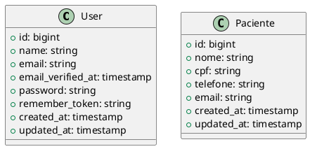

# 📊 Diagramas UML - Sistema Automático

Este projeto inclui geração automática de diagramas UML a partir dos models Laravel.

## 🚀 Como Usar

### Gerar Diagramas

```bash
# Via Artisan (gera apenas .puml)
php artisan generate:uml

# Via npm (gera .puml + .png)
npm run docs:uml

# Via composer
composer docs:uml
```

### Visualizar Online

```bash
# Abrir no PlantUML Online
npm run docs:uml:online
```

## 📁 Arquivos Gerados

- `storage/uml/domain-models.puml` - Código fonte PlantUML
- `storage/uml/domain-models.png` - Imagem do diagrama

## ⚙️ Sistema de Encoding

O sistema usa múltiplos métodos de encoding com fallback automático:

1. **Deflate + Base64** (padrão PlantUML)
2. **Base64 simples** (fallback)
3. **URL encoding** (último recurso)

Isso garante máxima compatibilidade com o PlantUML Online.

## 🔧 Personalização

### Models Suportados

O sistema analisa automaticamente todos os models em `app/Models/` e gera:

- Propriedades (campos do banco)
- Métodos públicos
- Relacionamentos
- Tipos de dados

### Exemplo de Output



## 🔄 Integração CI/CD

O GitHub Actions gera diagramas automaticamente:

```yaml
- name: Generate UML Diagrams
  run: |
    cd src
    npm run docs:uml
    
- name: Upload UML Artifacts
  uses: actions/upload-artifact@v3
  with:
    name: uml-diagrams
    path: src/storage/uml/
```

## 🛠️ Dependências

- **PHP**: Laravel Artisan para comando básico
- **Python**: Script avançado com validação (opcional)
- **Node.js**: Integração com npm scripts

## 🔍 Troubleshooting

### Problemas Comuns

1. **Diagramas não são gerados**
   ```bash
   # Verificar se os models existem
   ls src/app/Models/
   
   # Verificar permissões
   chmod +x scripts/generate-uml.sh
   ```

2. **Encoding não funciona**
   ```bash
   # Testar Python
   python3 -c "import zlib, base64; print('OK')"
   
   # Verificar sistema UML
   python3 scripts/check_uml_system.py
   ```

3. **PlantUML Online não abre**
   - Verificar conectividade com internet
   - URL pode estar muito longa (usar encoding alternativo)

## 📈 Monitoramento

O sistema monitora:
- ✅ Geração bem-sucedida de arquivos
- ✅ Validação de encoding
- ✅ Conectividade com PlantUML Online
- ✅ Tamanho dos diagramas gerados

## 🎯 Próximos Passos

- [ ] Suporte a relacionamentos entre models
- [ ] Geração de diagramas de sequência
- [ ] Integração com documentação automática
- [ ] Cache de diagramas para performance

---

**📊 Sistema robusto com múltiplos encoders e fallback automático**
