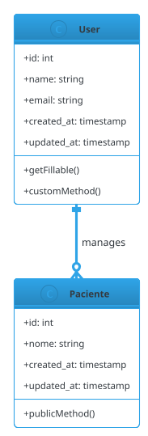

# Scripts UML - Geração de Diagramas

Esta pasta contém scripts para gerar diagramas UML em duas etapas: primeiro o arquivo `.puml` (PlantUML) e depois a imagem PNG.

## Como Funciona o Sistema

O sistema funciona em **duas etapas sequenciais**:

### Etapa 1: Gerar Arquivo PlantUML (.puml)

### Etapa 2: Converter para Imagem (Opcional)

## Fluxos de Uso

### Fluxo Básico (Apenas .puml)

```bash
# 1. Gerar arquivo PlantUML
php artisan generate:uml

# 2. Visualizar online (copiar conteúdo do arquivo)
# Abrir: https://www.plantuml.com/plantuml/uml/
# Colar conteúdo de: storage/uml/domain-models.puml
```

### Fluxo Completo (Com Imagem)

```bash
# 1. Gerar arquivo PlantUML
php artisan generate:uml

# 2. Gerar imagem PNG
python3 scripts/generate_uml_image.py

# 3. Abrir imagem gerada
# Arquivo: storage/uml/domain-models.png
```

### Fluxo Automatizado (NPM)

```bash
# Executa ambas as etapas automaticamente
npm run docs:uml
```

## Comandos Disponíveis

### Comandos Principais

```bash
# Gera .puml + PNG (comando completo)
npm run docs:uml

# Gera apenas arquivo .puml
npm run docs:uml:puml

# Gera formatos específicos
npm run docs:uml:png          # Imagem PNG
npm run docs:uml:svg          # Imagem SVG (vetorial)
npm run docs:uml:pdf          # Documento PDF

# Gera todos os formatos suportados
npm run docs:uml:all

# Lista formatos disponíveis
npm run docs:uml:formats

# Diagnóstico do sistema
npm run docs:uml:check
```

### Formatos Suportados

| Formato  | Extensão | Descrição           | Uso Recomendado              |
| -------- | -------- | ------------------- | ---------------------------- |
| **PNG**  | `.png`   | Imagem raster       | Documentação, apresentações  |
| **SVG**  | `.svg`   | Imagem vetorial     | Web, documentos escaláveis   |
| **PDF**  | `.pdf`   | Documento PDF       | Relatórios, impressão        |
| **EPS**  | `.eps`   | PostScript vetorial | Publicações acadêmicas       |
| **TXT**  | `.txt`   | ASCII art           | Terminal, texto plano        |
| **UTXT** | `.utxt`  | Unicode ASCII art   | Terminal com suporte Unicode |

## Como Visualizar

### Online (Recomendado)

1. Acesse: http://www.plantuml.com/plantuml/uml/
2. Copie conteúdo de `storage/uml/domain-models.puml`
3. Cole na caixa de texto
4. Veja o diagrama gerado automaticamente

### VS Code (Com Extensão)

1. Instale extensão "PlantUML"
2. Abra arquivo `.puml`
3. Use `Ctrl+Alt+P` para preview

### Imagem PNG (Localmente)

1. Execute `python3 scripts/generate_uml_image.py`
2. Abra o arquivo `storage/uml/domain-models.png`

## Solução de Problemas

```bash
# Diagnóstico
npm run docs:uml:check

# Regenerar arquivos
npm run docs:uml

# Ver conteúdo do arquivo .puml
cat storage/uml/domain-models.puml
```

## Fluxo de Geração

1. **Laravel:** `php artisan generate:uml` → Gera arquivo `.puml`
2. **Python:** `python3 scripts/generate_uml_image.py` → Converte para PNG
3. **Visualização:** Copie conteúdo para http://www.plantuml.com/plantuml/uml/ ou abra PNG

## Por Que Duas Etapas?

### Vantagens do Arquivo .puml

### Vantagens da Imagem PNG

## Dependências

## Como Funciona Tecnicamente

### Comando Artisan (`php artisan generate:uml`)

O comando é implementado na classe `GenerateUmlDiagram` em `app/Console/Commands/`:

```php
// 1. Busca todos os models no diretório app/Models
$models = $this->getModelClasses();

// 2. Para cada model, extrai:

// 3. Gera código PlantUML com:
```

**Processo:**

1. **Reflexão PHP:** Usa `ReflectionClass` para analisar models
2. **Detecção automática:** Encontra propriedades fillable via `getFillable()`
3. **Geração de código:** Monta string PlantUML formatada
4. **Gravação:** Salva em `storage/uml/domain-models.puml`

### Script Python (`generate_uml_image.py`)

O script converte PlantUML para múltiplos formatos usando a API do servidor PlantUML:

```python
# 1. Parse argumentos da linha de comando
parser.add_argument('--format', choices=['png', 'svg', 'eps', 'pdf', 'txt', 'utxt'])
parser.add_argument('--all-formats', action='store_true')

# 2. Lê arquivo .puml
with open(puml_file, 'r') as f:
    puml_content = f.read()

# 3. Para cada formato solicitado:
for fmt in formats_to_generate:
    # Codifica usando algoritmo PlantUML
    encoded = encode_plantuml_url(puml_content)

    # Faz requisição HTTP para servidor
    url = f"{server}/{fmt}/{encoded}"
    response = urllib.request.urlopen(url)

    # Salva arquivo no formato correto
    output_file = f"domain-models.{SUPPORTED_FORMATS[fmt]['ext']}"
    with open(output_file, 'wb') as f:
        f.write(response.read())
```

**Argumentos de linha de comando:**

**Codificação PlantUML:**

1. **Compressão DEFLATE:** `zlib.compressobj(wbits=-15)`
2. **Codificação 6-bit:** Converte bytes para caracteres PlantUML-safe
3. **Mapeamento:** `0-9` → `0-9`, `10-35` → `A-Z`, `36-61` → `a-z`, `62` → `-`, `63` → `_`

### Comandos NPM (package.json)

Os comandos NPM são wrappers que chamam os scripts subjacentes:

```json
{
    "docs:uml": "php artisan generate:uml && python3 scripts/generate_uml_image.py",
    "docs:uml:puml": "php artisan generate:uml",
    "docs:uml:png": "python3 scripts/generate_uml_image.py",
    "docs:uml:check": "python3 scripts/check_uml_system.py"
}
```

**Vantagens dos wrappers NPM:**

### Fluxo de Dados

```
Models Laravel → Reflexão PHP → Código PlantUML → Codificação → API PlantUML → Imagem PNG
     ↓              ↓              ↓               ↓            ↓
app/Models/    Artisan Command  .puml file    Python Script  .png file
```

### Tratamento de Erros

**Comando Artisan:**

**Script Python:**

### Estrutura dos Arquivos Gerados

**Arquivo .puml:**



**Arquivo .png:**

### Personalização e Extensão

**Modificar tema visual:**

```php
// Em GenerateUmlDiagram.php
$content .= "!theme cerulean-outline\n";  // Altere aqui
```

**Adicionar servidores PlantUML:**

```python
# Em generate_uml_image.py
PLANTUML_SERVERS = [
    "http://www.plantuml.com/plantuml",
    "https://www.plantuml.com/plantuml",
    "http://seu-servidor-custom.com/plantuml"  # Adicione aqui
]
```

**Configurar saída personalizada:**

```bash
# Artisan command aceita opção --output
php artisan generate:uml --output=docs/diagrams/
```
